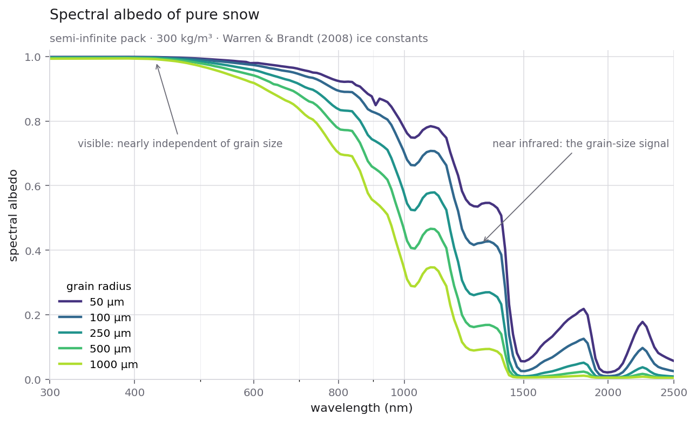
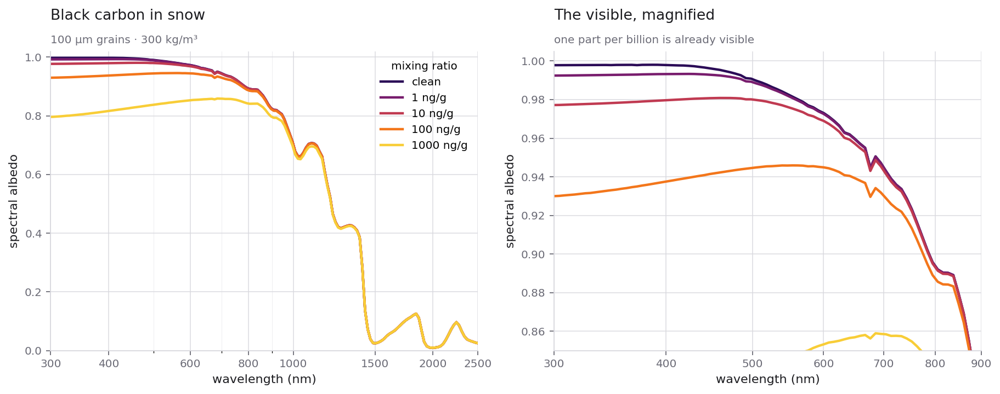
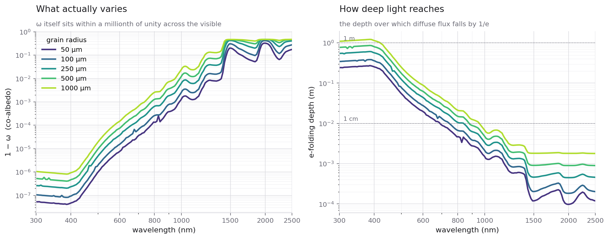
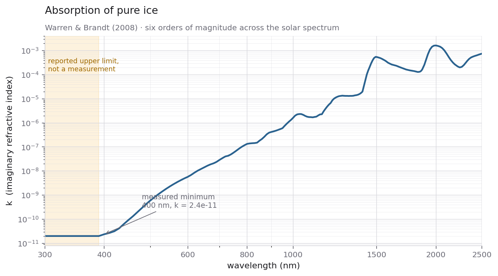
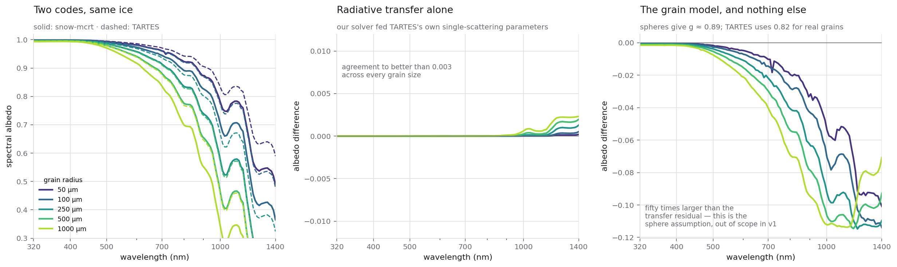

# snow-mcrt

Monte Carlo photon transport for light propagation in snow, validated against
closed-form radiative transfer and the canonical snow-optics literature.

## How this started

I spent a while doing optical materials design — ray tracing through disordered
media, where light does not travel in straight lines and every useful answer
comes out of a scattering calculation rather than a geometric one.

I missed it. And a question kept nagging: **could the same machinery find
things buried inside a material?** If light diffuses through a disordered
medium and comes back out, it has been somewhere, and what it met on the way is
encoded in how it returns.

Then a second thought, which is what actually made this a project. Snow is a
disordered random medium too — ice grains packed at random, light scattering
thousands of times before it escapes or is absorbed. Same physics, a medium
anyone can walk on, and a literature going back forty years with hard numbers
to check against.

So: **can I simulate light in snow, correctly enough that the answer would be
believed?** That question comes first, because the buried-object idea is
worthless without it. An engine that cannot reproduce a published albedo curve
has no business predicting what is under the surface.

This repository is the answer to the first question. The second one is scoped
in [`docs/detectability.md`](docs/detectability.md), and the engine already has
something surprising to say about it.

## Light in snow, from first principles



Snow is brilliant white to the eye and dark in the near infrared, and both
facts come out of the same calculation. Nothing above is fitted: Mie theory on
ice grains, measured optical constants, a radiative transfer solution. The
absorption bands at 1030, 1250, 1500 and 2000 nm are not put in by hand — they
fall out of the ice.

## What this is

A clean, testable engine for the physics of light in snow. It answers four
questions, each checked against something independent:

1. **Spectral albedo of pure snow** across grain sizes — Wiscombe & Warren (1980).
2. **The effect of absorbing impurities** — Warren & Wiscombe (1980).
3. **How deep light penetrates** — e-folding depth, against field measurement.
4. **Cross-checks** against SNICAR and TARTES for matching parameters.

Everything is validated. Where a closed-form solution exists, the engine must
reproduce it; where an exact invariant holds, it must hold to floating point.

## What it found

Building it turned up four things worth stating on their own.

**The two-stream albedo is not accurate enough to validate a Monte Carlo.**
It runs 18.7% high at `omega = 0.5` and 8.9% at 0.9, converging only in the
conservative limit. The transport matches van de Hulst's fit to the exact
solution to a fraction of a percent. Judging the engine against two-stream
would have meant chasing a bug that was the yardstick all along.

**A uniform `mu` grid silently destroys the Mie phase function.** At snow size
parameters the forward diffraction peak spans microradians. A uniform
20 001-point grid steps over it and produces a "phase function" that integrates
to 20.4 with a mean cosine above one. Nothing raises at the point of use.

**Monodisperse spheres are an actively misleading idealisation.** A perfect
sphere supports resonances that spike absorption 13-fold at isolated
wavelengths, putting spectral features in the albedo curve that no real
snowpack has. A 5% spread in grain size destroys them. The default here is a
log-normal distribution, not a single radius.

**Russian roulette conserves energy only in expectation.** Residuals are
sign-changing at the 1e-6 level; with roulette off the ledger closes to float64
epsilon. That is an unbiased estimator behaving correctly, not a leak, and the
tests assert the two cases separately.

## Results

### Impurities



One part per billion of black carbon is already visible. A hundred takes
visible albedo from 0.99 to the mid 0.95s — reproducing Warren & Wiscombe
(1980) with no tuning. Mineral dust needs roughly a hundred times the mass for
comparable darkening, which is why the field quotes carbon in ppb and dust in
ppm.

### What varies, and how deep light reaches



The single-scattering albedo `omega` sits within a millionth of unity across
the visible, so `1 - omega` is the quantity that actually moves — and it spans
six orders of magnitude. That is why visible albedo is an impurity diagnostic
while the near infrared is a grain-size one.

### The ice underneath it all



Everything above follows from this curve. Note the shaded band: below 390 nm
the tabulated `k` is a reported *upper limit*, not a measurement, so
penetration depths computed there are bounds rather than predictions.

## Validated against an independent implementation



Two codes producing similar curves proves very little. The interesting question
is *where* they differ, so the comparison against TARTES (Libois, Picard et
al., 2013) is decomposed rather than reported as a single number.

Both codes read the same Warren & Brandt (2008) constants — verified, not
assumed. Then TARTES's own single-scattering parameters are fed into **our**
radiative transfer solver. If the two then agree, they solve the transfer
problem the same way and everything else between them is a modelling choice.

| grain radius | transfer residual | grain-model residual |
| ------------ | ----------------- | -------------------- |
| 50 μm        | 0.00020           | 0.10087              |
| 100 μm       | 0.00051           | 0.11388              |
| 250 μm       | 0.00128           | 0.11475              |
| 500 μm       | 0.00197           | 0.11454              |
| 1000 μm      | 0.00231           | 0.11373              |

**The transfer solution agrees to better than 0.003. The remaining 0.11 is
entirely the grain model** — a factor of fifty between them.

And that residual has a name. Full Mie on spheres gives `g ≈ 0.89`; TARTES uses
`0.82`, calibrated for the non-spherical grains real snow is actually made of.
Spheres over-predict forward scattering, photons therefore travel deeper per
collision and accumulate more path in ice, and our albedo sits below TARTES
everywhere the ice absorbs at all. In the blue, where absorption nearly
vanishes, the two converge regardless.

Non-spherical morphology is explicitly out of scope for v1. This measures that
limitation rather than hiding it.

## Architecture

Clean/hexagonal, and each port earns its place:

```
src/snow_mcrt/
  domain/        physics; imports no array library and no numerical package
    optics.py      complex refractive index, units and sign conventions
    mie.py         single-scattering properties, grain size distributions
    phase.py       Henyey-Greenstein and tabulated phase functions
    medium.py      snowpack layers, impurities, external mixing
    transport.py   vectorised Monte Carlo photon transport
    analytic.py    closed-form solutions -- the oracle
  ports/         backend (NumPy/CuPy), Mie solver, optical data
  adapters/      NumPy is the oracle, not a fallback; CuPy; miepython
  application/   one use case per research question
  infra/         CSV and manifest writers
scripts/         run (headless, draws nothing) and plot (never simulates)
data/ice/        optical constants, with provenance
data/reference/  committed results, so figures reproduce without re-running physics
```

Photons are **an axis of the array**, not an iteration: the transport loop runs
once per scattering order and every live photon steps together. The backend
port keeps `domain/` free of any array-library import, which is what makes the
NumPy oracle possible — and it is why the same physics will run on a GPU.

Full rationale, the conventions that are silent when wrong, and the measured
case for the GPU: [`docs/architecture.md`](docs/architecture.md).

## Running on a GPU

The CuPy adapter is validated on real hardware — results committed under
[`results/kaggle/`](results/kaggle/), produced on a Tesla P100.

Against the NumPy oracle, agreement tightens as the medium gets brighter:
0.50% at `omega = 0.5`, 0.053% at 0.9, 0.016% at 0.95. More photons survive
longer, so the estimator has more to work with.

The timing is worth stating honestly, because it is not a straight win:

| `omega` | NumPy | CuPy | speedup |
| ------- | ----- | ---- | ------- |
| 0.50 | 0.33 s | 4.43 s | **0.07x** |
| 0.90 | 1.24 s | 0.19 s | 6.5x |
| 0.95 | 2.74 s | 0.37 s | 7.4x |

At `omega = 0.5` the transport finishes in two dozen scattering orders and
kernel launch overhead dominates completely — the GPU is thirteen times
*slower*. It pays in deep transport and nowhere else, which is the same
conclusion the architecture reached from the other direction.

Deep transport at 500 000 photons reproduces the analytic solution to 0.02%,
0.08% and 0.14% at 700, 900 and 1100 nm, with `truncated = 0` throughout. The
`1/(1 - omega)` cost law comes out measured rather than asserted: a factor of
37 in co-albedo buys 33 times the scattering orders and 32 times the wall
clock.

```bash
kaggle kernels push -p kaggle
kaggle kernels output fran17/snow-mcrt-gpu-validation -p results/kaggle
```

## Getting started

```bash
uv venv && uv pip install -e '.[dev]'
pytest                                    # 181 passed, 4 skipped without CUDA

python scripts/run_albedo.py --output data/reference     # compute, draw nothing
python scripts/plot_albedo.py --output docs/figures      # draw, compute nothing
```

That split is deliberate. `run_albedo.py` opens no windows, so it runs
unchanged in a batch job; `plot_albedo.py` reads committed CSVs, so a figure
can be restyled without waiting on any physics. Every run writes a manifest
recording every parameter that produced it, seed included.

CuPy is optional (`pip install -e '.[gpu]'`). Without it the GPU tests skip and
everything else runs.

## Physics scope — v1

- Multiple scattering by ice grains via Mie theory, over a log-normal size
  distribution.
- Ice optical constants from Warren & Brandt (2008), 44 nm to 2 m.
- Henyey–Greenstein and full-Mie phase functions.
- Absorbing impurities (black carbon, mineral dust) as mixing ratios, externally
  mixed.
- Semi-infinite and finite plane-parallel slabs.
- GPU acceleration through the backend port.

**Out of scope in v1:** non-spherical grain morphology, internal mixing of
impurities, coherent effects, polarization, 3-D geometry, snow metamorphism,
coupled atmospheric radiative transfer.

## Back to the original question

Can this find objects buried in snow? [`docs/detectability.md`](docs/detectability.md)
scopes it properly. The short version, computed with the engine above:

**The depth limit is set by how clean the snow is, not by the optical
properties of ice.** In the blue, where ice is at its most transparent, pure
ice alone would let light reach nearly half a metre. One nanogram per gram of
black carbon — one part per billion, cleaner than almost anywhere on Earth —
cuts that to 10 cm.

Two more results that changed the shape of the problem:

- The diffuse sensitivity kernel peaks at **`rho/3`**, not the `rho/2` of the
  tissue-optics rule of thumb. Probing 30 cm needs a metre-scale baseline.
- **Photon budget is not the constraint.** Even at a 150 cm separation a
  half-millijoule pulse delivers eighteen times the photons a 1% contrast
  measurement needs. The real limit is clutter — natural snowpack layering
  perturbs the diffuse field just as a buried object does — which turns the
  question from amplitude into separability.

It is the same lineage as diffuse optical tomography in tissue, and MCML, the
canonical Monte Carlo for photon transport in tissue, was already in this
project's bibliography before the connection was obvious.

Honest positioning: this does not compete with avalanche beacons. RECCO and
transceivers win at depth because dry snow is nearly transparent at radio
frequencies. Optical is capped at tens of centimetres and no engineering moves
that. Where it does stand up — detectability-limit theory, very clean polar
snow, and **voids rather than absorbers**, since a cavity perturbs diffusion far
more strongly than an absorber of the same size — is set out in the note.

## The GPU, measured

The CuPy adapter has now run on real hardware — a Tesla P100 — and the results
are committed under [`results/kaggle/`](results/kaggle/).

| `omega` | NumPy | CuPy | speedup |
| ------- | ----- | ---- | ------- |
| 0.50 | 0.33 s | 4.43 s | **0.07x** |
| 0.90 | 1.24 s | 0.19 s | 6.5x |
| 0.95 | 2.74 s | 0.37 s | 7.4x |

The first row is not a typo. At `omega = 0.5` transport finishes in about two
dozen scattering orders and kernel launch overhead dominates completely, making
the GPU thirteen times *slower*. It pays in deep transport and nowhere else,
which is exactly what the architecture notes argued from the other direction.

Deep transport at 500 000 photons agrees with the analytic solution to 0.02%,
0.08% and 0.14% at 700, 900 and 1100 nm, with zero truncated weight. And the
`1/(1 - omega)` cost law is now measured rather than asserted: a factor of 37
in co-albedo buys 33 times the scattering orders and 32 times the wall clock.

## Known gaps

- The four benchmark notebook reproductions are not written yet.
- SNICAR cross-check not started. TARTES is done — see above.
- Clean snow at 500 nm (`1 - omega ~ 5e-6`) is still out of reach: it needs of
  order a million scattering orders, over an hour even on a P100.
- Grain morphology is spheres only, and the TARTES comparison measures exactly
  what that costs.

## References

[`docs/bib/references.md`](docs/bib/references.md). Scope detail in
[`docs/scope.md`](docs/scope.md). Data provenance in
[`data/ice/SOURCE.md`](data/ice/SOURCE.md).

## License

MIT — see [`LICENSE`](LICENSE).

The ice optical constants under `data/ice/` are the published Warren & Brandt
(2008) compilation and carry their own terms. See
[`data/ice/SOURCE.md`](data/ice/SOURCE.md) for citation and provenance.
