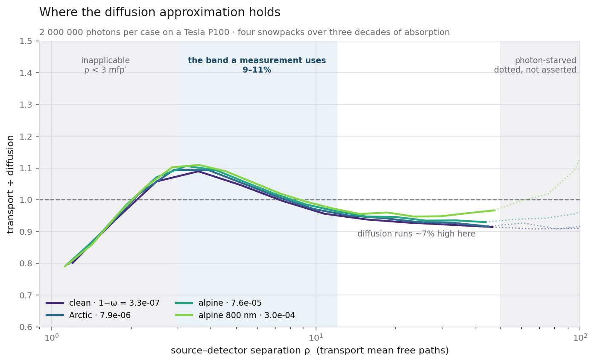
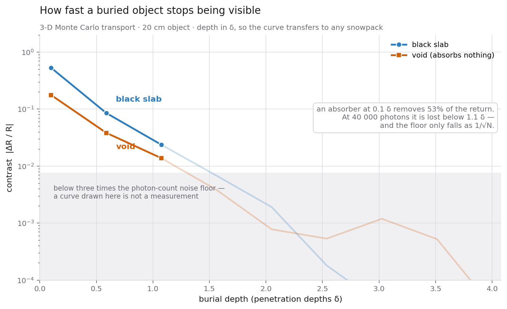
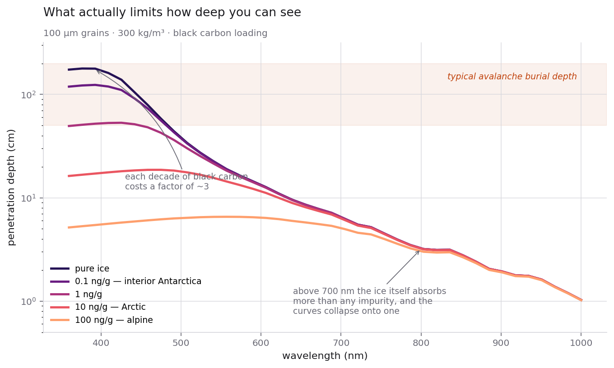
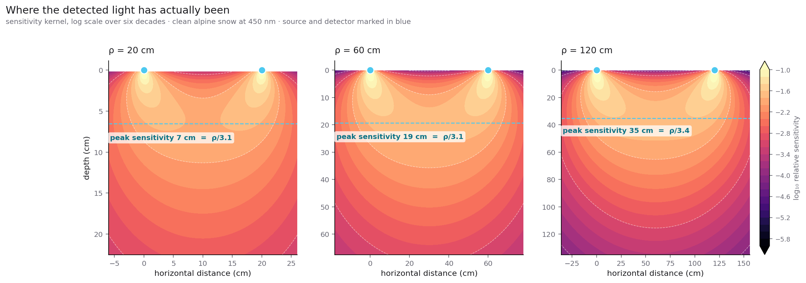
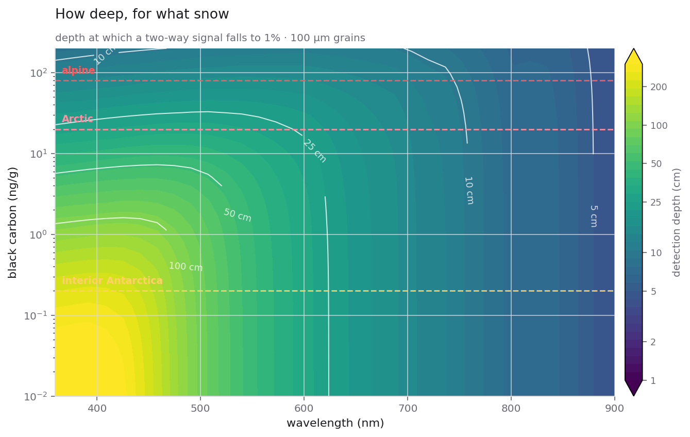
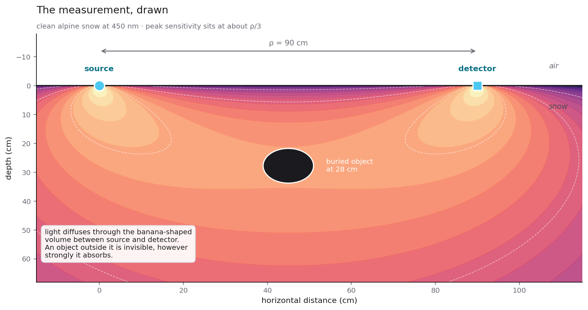

# Detecting buried objects in snow — a design note

Where this project could go after v1, what the physics allows, and what the
engine would have to become. Written before any of it is built, so the
constraints are on the record rather than discovered halfway through.

**Status:** exploratory, and now partly built. The diffusion theory this note
rests on is implemented and tested in `snow_mcrt.domain.diffusion` — fluence,
diffuse reflectance, the sensitivity kernel, the extrapolated boundary — so
every figure and every number below is produced by code under test rather than
by arithmetic in a margin.

**Three-dimensional transport now exists**, in `snow_mcrt.domain.transport3d`,
with a real Fresnel surface at `n = 1.31`, ray-box intersection in
`snow_mcrt.domain.geometry`, and objects that carry their own extinction,
albedo and refractive index. Two things follow.

Diffusion theory is an *approximation*, and until there was a transport
solution to compare it against, none of the numbers in this note had a stated
accuracy. They do now — see [Where diffusion holds](#where-diffusion-holds),
and read every figure below through it. The engine was deliberately validated
against its one available oracle *before* geometry was added, so that a later
disagreement can be blamed on the geometry rather than argued about.

And the central question of this note — how fast an object stops being visible
with depth — has been answered by tracing photons rather than by argument. See
[How fast detection actually fades](#how-fast-detection-actually-fades).

What still does *not* exist: detectors with a real aperture and acceptance
angle, non-spherical grains, layered snowpacks, and any object that is not an
axis-aligned box. Those are scoped at the end.

**Updated with the real dataset.** An earlier version of this note used
order-of-magnitude placeholders for the ice absorption. Warren & Brandt (2008)
is now in `data/ice/`, and every depth has been recomputed against it. The
placeholders were wrong in both directions — 9x too optimistic at 450 nm, 3x
too pessimistic at 500 nm — so the numbers below supersede them. The
conclusions did not change; the magnitudes did.

## The question

> To what depth can an object buried in snow be detected optically, as a
> function of burial depth, object size and contrast, snow grain size,
> impurity loading, and wavelength — and what measurement geometry does it
> take?

Well-posed, falsifiable, and squarely answerable with a validated Monte Carlo
transport code. Note what it is not: it is not "build an avalanche beacon".
The answer may well be "23 cm", and that is a result rather than a failure.

## This problem already has a mature sibling

What is being described is **diffuse optical tomography**: reconstructing
inclusions inside a strongly scattering medium from light that has diffused
through it. The medical version — imaging haematomas, or cerebral blood
oxygenation through the skull — has three decades of theory behind it.

The bibliography already points there. Wang, Jacques & Zheng (1995), MCML, is
the canonical Monte Carlo for photon transport in multi-layered *tissue*. The
methodological reference chosen for the snow work is the one the neighbouring
field built its instruments on.

Snow is a *better* diffuser than tissue: `omega` closer to 1, comparable `g`.
Diffusion theory is more reliable here, not less, which means the analytic
machinery transfers with the approximations in better shape than the people
who developed them enjoyed.

That was an argument. Below it is a measurement.

## Where diffusion holds

Every figure in this note is a diffusion calculation, so the first question a
reader should ask is how wrong diffusion is. Until the 3-D engine existed there
was no way to answer; now there is, because transport makes no closure
assumption at all and can simply be run.

Measured on a Tesla P100 at **two million photons per case**, over four
snowpacks spanning three orders of magnitude in co-albedo
([`results/kaggle/`](../results/kaggle/)):

| case | `1 - omega` | `delta` | 3–12 `mfp'` | all `< 12 mfp'` | 12–50 `mfp'` |
| ---- | ----------- | ------- | ----------- | --------------- | ------------ |
| clean, 450 nm | 3.3e-07 | 91.3 cm | **9.0%** | 19.9% | 8.6% |
| Arctic, 450 nm | 7.9e-06 | 18.5 cm | **9.3%** | 20.1% | 8.4% |
| alpine, 450 nm | 7.6e-05 | 6.0 cm | **10.6%** | 20.5% | 7.0% |
| alpine, 800 nm | 3.0e-04 | 3.0 cm | **10.9%** | 21.0% | 5.3% |

Each entry is the largest departure of `R_MC(rho) / R_diffusion(rho)` from one
inside that band.

**Read the first column, not the second.** Inside about three transport mean
free paths diffusion is not a poor approximation, it is an inapplicable one:
the photon has not yet forgotten which way it was going, which is the entire
premise. The innermost bin comes back at 0.79–0.80 in all four cases — the
premise failing, not the approximation degrading. A worst case taken over
everything closer than 12 `mfp'` is dominated by that region and doubles the
apparent error.

So: **diffusion is good to about 10% over the separations a source-detector
pair actually uses, and to 5–9% from 12 to 50 transport mean free paths.**
Every depth and contrast in this note inherits that.

The shape is worth stating because it is not the obvious one. The ratio dips
below one at the source, crosses one between three and seven `mfp'`, peaks
near 1.03, and settles around 0.93 further out. It is **not monotonic**, and
an earlier reading of a narrower range suggested it was — diffusion does not
simply degrade with distance, it errs in one direction near the source and the
other beyond.

Beyond about 50 `mfp'` the comparison stops being a measurement of diffusion
and starts being a measurement of photon budget. The profile falls seven
orders of magnitude, so the far bins starve long before the near ones; one
clean-snow bin came back at 0.085 on two million photons. Those bins are
reported and not interpreted.

Two things had to line up before any of this meant anything. Both solvers must
see the same **surface** — diffusion carries the index mismatch as an
effective internal reflection coefficient and the engine carries it as Fresnel
at each escape, and the two agree to 0.07% (asserted in `tests/test_fresnel.py`).
And both must see the same **source**, so the engine runs a collimated pencil
beam to match the Green's function.

### The band is reproducible on a laptop; the reflectance is not

Worth separating, because the two have different budgets.

`data/validation/mc-diffusion-*.csv` holds the same four cases at 120 000
photons — about twenty minutes on one core. Against the GPU runs at two
million:

| case | band, CPU | band, GPU | reflected, CPU | reflected, GPU |
| ---- | --------- | --------- | -------------- | -------------- |
| clean, 450 nm | 8.8% | 9.0% | 0.9548 | **0.9915** |
| Arctic, 450 nm | 8.2% | 9.3% | 0.9463 | **0.9633** |
| alpine, 450 nm | 11.4% | 10.6% | 0.8905 | 0.8912 |
| alpine, 800 nm | 11.4% | 10.9% | 0.7954 | 0.7950 |

The band agrees to **1.1 points** while the total reflectance is off by **3.7**
on clean snow. That is not luck. Truncating a run discards the photons with
the longest paths, and those are the ones populating the far tail and the
total; the intermediate field is made of photons that left long before the
budget ran out.

So a laptop can measure *where diffusion holds*, which is what this note needs.
It cannot measure *how much light comes back* from clean snow in the visible —
nothing on a CPU can, and a run that reports 0.9548 for a quantity that is
0.9915 does not announce itself. Only the `truncated` column distinguishes it
from a converged answer.

## How fast detection actually fades

Every depth number further down this note comes from diffusion theory and a
two-way attenuation argument. This one comes from tracing photons past an
object that is actually there.

A 20 cm slab, buried at a series of depths, in snow whose penetration depth is
6 cm. Depth is in units of `delta` so the curve transfers; contrast is the
fractional change in returned light, which is what an instrument measures
against an unknown source brightness.

| depth | black slab | void |
| ----- | ---------- | ---- |
| 0.1 δ | **−52.9%** | −17.6% |
| 0.6 δ | −8.5% | −3.8% |
| 1.1 δ | −2.4% | −1.4% |
| 1.6 δ | −0.7% | −0.4% |

Three things worth taking from it.

**The fall is steep — roughly a factor of six per penetration depth.** That is
the two-way attenuation the note argues for, now measured rather than assumed:
light has to reach the object and come back, so the signal goes as `exp(-2z/δ)`
rather than `exp(-z/δ)`.

**A void is a third as visible as a black slab, and it absorbs nothing.** It
removes light by carrying photons in a straight line to its far wall, well
below the depth anything returns from — a light pipe pointing away from the
detector. The note predicted cavities would perturb strongly; the sign and the
size are now measured.

**The floor is a budget, not a physical limit.** The shaded band is three times
the Monte Carlo noise floor at 40 000 photons, and everything below it is
noise that a log axis renders as a convincing curve. It falls as `1/sqrt(N)`,
so four times the photons buys about another third of a penetration depth —
which is exactly why the deep cases run on a GPU.

## The figures

Pure ice reaches nearly two metres at 390 nm. Each decade of black carbon costs
about a factor of three, and above 700 nm every loading collapses onto the same
curve — there the ice outabsorbs any trace impurity, so cleanliness stops
mattering and nothing penetrates far anyway.

Where the detected light has actually been, at three separations. The banana
grows with `rho` and its peak sits at `rho/3.1`, `rho/3.1`, `rho/3.4` — printed
on the panels, computed rather than quoted. Note the colour scale is
logarithmic over five decades: the true maximum is at the source and detector,
where a point-source fluence diverges, so a linear scale shows two bright dots
and no banana at all.

Detection depth over cleanliness and wavelength, with real snowpacks marked.
The usable region is the bottom-left corner — clean snow, blue light — and it
shrinks fast in every direction.

## The regime

From the v1 engine, 100 um grains, 300 kg/m³:

| quantity                          | value    |
| --------------------------------- | -------- |
| scattering mean free path `l`     | 0.20 mm  |
| transport mean free path `l*`     | 1.83 mm  |
| reduced scattering `mu_s'`        | 548 m⁻¹  |
| diffusion coefficient `D`         | 0.61 mm  |

`l* / l = 1/(1-g) = 9`, so a photon needs about nine collisions to forget
where it was going. Any object deeper than a centimetre or so is being viewed
through a fully diffusive medium — there is no ballistic component to work
with, and every useful observable is a diffusion observable.

## What sets the depth limit — and it is not what you would guess

Ice is extraordinarily transparent in the blue. Its absorption minimum sits
near 390–400 nm, which is why deep glacial ice looks blue. Against pure ice
absorption alone, penetration is generous:

At 400 nm, where Warren & Brandt report the deepest genuinely *measured*
minimum, `k = 2.365e-11`:

| grain  | e-folding depth | depth at 1% two-way signal |
| ------ | --------------- | -------------------------- |
| 100 um | 36.0 cm         | 82.8 cm                    |
| 1 mm   | 114.0 cm        | 262.6 cm                   |

Better than a metre in coarse snow. Encouraging — and misleading.

(Below 390 nm the tabulated `k` flattens onto a reported *upper limit* of
2.0e-11 rather than a measurement, so anything computed there is a bound. 400 nm
is the shortest wavelength with a real number behind it.)

Because ice is *so* weakly absorbing there, trace impurities take over
completely:

100 um grains at 400 nm, 300 kg/m³:

| black carbon | `1 - omega` | e-folding depth | depth at 1% two-way signal |
| ------------ | ----------- | --------------- | -------------------------- |
| 0 ng/g       | 9.3e-08     | 36.0 cm         | 82.8 cm                    |
| 0.1 ng/g     | 1.8e-07     | 25.8 cm         | 59.4 cm                    |
| **1 ng/g**   | 9.7e-07     | **11.1 cm**     | **25.6 cm**                |
| 5 ng/g       | 4.5e-06     | 5.2 cm          | 11.9 cm                    |
| 20 ng/g      | 1.8e-05     | 2.6 cm          | 6.0 cm                     |
| 100 ng/g     | 8.8e-05     | 1.2 cm          | 2.7 cm                     |

**One nanogram per gram of black carbon cuts the useful depth from 36 cm to
11 cm.** One part per billion.

Coarse grains help but do not rescue it: 1 mm grains go from 114 cm clean to
35 cm at 1 ng/g.

And 1 ng/g is cleaner than almost anywhere on Earth. Remote Antarctic snow is
of order 0.1–0.3 ng/g; Arctic snow runs 5–50; mid-latitude mountain snow 10–100
(figures approximate, pending proper citation).

So the governing conclusion, and it is not obvious in advance:

> The optical depth limit in snow is set by how clean the snow is, not by the
> optical properties of ice.

This single fact should drive the whole research programme. It also means the
impurity machinery already built in v1 is not a side feature here — it is the
central variable.

## The sensitivity kernel

In a diffusive medium, a source and a detector separated by `rho` sample a
banana-shaped volume between them. The tissue-optics rule of thumb puts its
peak at `rho/2`. With snow's actual parameters, computed from the diffusion
Green's function with an extrapolated boundary:

| separation `rho` | peak sampling depth | ratio |
| ---------------- | ------------------- | ----- |
| 10 cm            | 3.2 cm              | 0.32  |
| 20 cm            | 6.6 cm              | 0.33  |
| 40 cm            | 13.2 cm             | 0.33  |
| 60 cm            | 19.3 cm             | 0.32  |
| 100 cm           | 30.2 cm             | 0.30  |
| 150 cm           | 41.9 cm             | 0.28  |

**`rho/3`, not `rho/2`**, and the ratio drifts downward once absorption starts
to bite past a metre. To interrogate 30 cm of snow you need source and detector
about a metre apart. That is a hard geometric constraint on any instrument, and
it is worth knowing before anyone designs a handheld device.

## Photon budget is not the limiting factor

Diffuse reflectance falls steeply with separation — five orders of magnitude
from 10 cm to 150 cm — but it falls from a very large number:

| `rho`  | probes | relative `R` | detected photons in 1 cm² from a 1e15-photon pulse |
| ------ | ------ | ------------ | -------------------------------------------------- |
| 10 cm  | 3.3 cm | 1.00         | 8.4e10                                             |
| 40 cm  | 13 cm  | 1.3e-02      | 1.1e09                                             |
| 100 cm | 33 cm  | 4.0e-04      | 3.3e07                                             |
| 150 cm | 50 cm  | 5.6e-05      | 4.6e06                                             |

A 1e15-photon pulse at 450 nm is about half a millijoule. Trivial.

Against shot noise, detecting a fractional contrast `C` at signal-to-noise `s`
needs `N >= (s/C)²` detected photons:

| contrast | SNR 5 requires    |
| -------- | ----------------- |
| 10%      | 2 500 photons     |
| 3%       | 27 778 photons    |
| 1%       | 250 000 photons   |

Even at `rho = 150 cm` there are 4.6e6 photons available — eighteen times what
a 1% contrast measurement needs.

**So the instrument is not photon-starved.** That kills the obvious engineering
objection and moves the real question elsewhere.

## The real limit is clutter, not noise

If shot noise is not the constraint, what is? Natural snowpack structure that
produces the same signal as the thing being looked for.

A real snowpack is layered. Density varies from 100 to 500 kg/m³ between
strata, grain radius from 50 um to over 1 mm across a melt-freeze crust or a
depth-hoar layer, and impurity loading varies with deposition history. Every
one of those perturbs the diffuse field. A buried object is a perturbation
competing against a background of perturbations.

This reframes the research question into its useful form:

> Not "can we detect a 1% contrast?" — we can. But: **is the object's signature
> separable from the snowpack's own?**

That is a question about *structure*, not amplitude, and it is what makes the
time-resolved measurement interesting rather than merely a refinement.

## Observables that carry depth information

**Spatially resolved reflectance `R(rho)`.** Vary the separation, sample
different depths. Simple; needs the metre-scale baselines computed above; badly
confounded by layering, since a horizontal layer and a buried object both change
`R(rho)` smoothly.

**Time-resolved `R(rho, t)`.** Pulse the source, histogram photon arrival
times. Late photons went deeper — the mapping from time to depth is far more
direct than the mapping from separation to depth, and the *shape* of the
temporal distribution discriminates a compact object from a horizontal layer in
a way that any steady-state measurement cannot. A layer shifts the whole curve;
a localised absorber removes a specific slice of path lengths.

In a Monte Carlo this costs **one extra accumulator**: total path length per
photon, already implicit in the free-path sampling. It is the cheapest large
capability available, and it should be added to the 1-D engine before the 3-D
work starts, where it is easy to validate against the analytic
time-domain diffusion solution.

**Frequency-domain.** Modulate the source, measure amplitude and phase shift.
Information-equivalent to time-resolved, easier instrumentation, worse depth
resolution. Worth noting; not worth building first.

## What the architecture would have to become

The v1 transport core is 1-D, plane-parallel and azimuthally symmetric. A
buried object breaks both symmetries. This is a genuine extension, not a
parameter change.

**Photon state grows.** From `(z, mu, weight)` to
`(x, y, z, ux, uy, uz, weight, pathlength)`. The azimuthal reduction that made
v1 cheap is gone — position and direction both become 3-vectors. Roughly triple
the array traffic per step, before any geometry.

**Ray-object intersection enters — the geometric kind.** Sphere, box, and
eventually a mesh. This is where ray tracing in the rendering sense genuinely
appears, having been absent from v1 despite the project's name.

**The air-snow interface stops being ignorable.** v1 lets photons enter freely,
which is fine when the observable is a hemispheric albedo. With a source and a
detector both sitting on the surface, Fresnel reflection and refraction at the
boundary shape the near-field response directly. `n = 1.31` gives an internal
reflection coefficient that materially changes the extrapolated boundary
condition — the `zb` already used in the Green's function above.

**Detectors become objects.** Spatial binning in `rho`, temporal binning in
path length, and an acceptance solid angle. v1 has no detector concept at all;
it counts everything that escapes.

**Cost lands squarely on the GPU.** v1 already measured 200 000 scattering
orders for clean visible snow on one CPU core. Three-dimensional geometry,
millions of photons, and a source-detector scan multiplies that. The backend
port exists precisely so this is a configuration change rather than a rewrite.

## How it stays honest

The discipline that made v1 trustworthy applies unchanged, and the extension
happens to come with unusually good oracles.

**The 1-D engine becomes a regression test.** A 3-D code with no object in it,
integrated over the surface, must reproduce the v1 albedo exactly. Not
approximately — the same physics computed two ways. That is the strongest
possible check on the new geometry, and it is free.

**Diffusion theory is the analytic oracle again.** The semi-infinite Green's
function with an extrapolated boundary — the one that produced the `rho/3`
table above — predicts `R(rho)` and `R(rho, t)` in closed form for a
homogeneous pack. The 3-D Monte Carlo must reproduce it wherever diffusion
theory is valid, which for snow is nearly everywhere beyond a few `l*`.

**Born approximation for the object.** For a weak, small inclusion the contrast
has a closed form in terms of the same Green's functions. It will fail for a
large strongly absorbing object — a person is not a perturbation — but it
brackets the small-object limit, and a Monte Carlo that disagrees with it
*there* is wrong.

**Publish the limits, not just the successes.** The deliverable is a
detectability surface: depth versus object size versus impurity loading versus
wavelength, with the SNR and clutter assumptions stated. Where it says
"undetectable", that is the result.

## Honest positioning

Avalanche rescue already has RECCO (866 MHz radar), transceivers (457 kHz) and
ground-penetrating radar. They win at depth, and for a hard physical reason:
dry snow is nearly transparent at radio frequencies, so those systems work
through metres. Optical is confined to tens of centimetres by the impurity
result above, and no amount of engineering moves that.

So this work should not be framed as competing with beacons. Where it stands up:

1. **Detectability-limit theory.** A rigorous, falsifiable answer to how deep
   optical detection can reach and what governs it. Publishable on its own, and
   the impurity dominance is a genuinely non-obvious finding.
2. **Very clean snow.** Antarctic and interior Greenland snow at 0.1–0.3 ng/g
   puts half a metre within reach. Different applications — buried instruments,
   crevasse bridging, firn structure.
3. **Voids rather than absorbers.** A cavity perturbs the diffusion far more
   strongly than an absorbing body of the same size, because it removes
   scattering rather than adding absorption. Contrast is much more favourable,
   and crevasse detection is a real problem.
4. **Snowpack stratigraphy.** The clutter that limits object detection is
   itself the signal for a different question. The same instrument that
   struggles to find a buried pack is well suited to profiling layer structure
   non-destructively.

Direction 3 is the one worth examining first, because the physics favours it
and nobody has to be rescued for the result to matter.

## Caveats

- Ice constants are now the real Warren & Brandt (2008) compilation, and every
  depth here was recomputed against it. Below 390 nm their `k` is a reported
  upper limit rather than a measurement, so this note quotes 400 nm.
- Grain sizes are log-normal with `sigma_g = 1.5`. A monodisperse calculation
  would put resonance spikes in these numbers; see the README.
- Impurity concentrations by region are quoted from memory and need proper
  citation before they appear in anything external.
- Diffusion-theory numbers assume a homogeneous semi-infinite pack. Real
  layering is exactly what the clutter section says will break this.
- Black carbon is treated as externally mixed, so the darkening — and hence the
  depth limits — are conservative. Internal mixing absorbs roughly twice as
  strongly per unit mass and would shorten every depth quoted here.

## Suggested sequence

1. Finish v1. The four benchmark reproductions are the credentials; without
   them no detectability number is believable.
2. Add path-length accumulation to the 1-D engine and validate against the
   time-domain diffusion solution. Cheap, and it de-risks the most valuable
   observable.
3. Build the 3-D transport with no object, and prove it reproduces v1.
4. Add geometry, then a single spherical inclusion, and check the small-object
   limit against Born.
5. Only then, the detectability surface.
